# smps_measurement_gallery
This gallery presents a selection of measurements obtained with the automated measurement framework described in my paper [link to paper], which I presented at APEC 2026.

The gallery is divided into two main sections:
- DC/DC converters
- AC/DC converters

# Contents

- [DC/DC Converters](#dcdc-converters)
  - [LM25116 Family](#lm25116-family)
    - [LM25116 Stock Configuration](#lm25116-stock-configuration)
    - [LM25116 with Additional 3 uF Output Capacitance](#lm25116-with-additional-3-uf-output-capacitance)
    - [Differential Comparison: Stock Configuration vs. Additional 3 uF Output Capacitance](#differential-comparison-stock-configuration-vs-additional-3-uf-output-capacitance)
  - [AP3012-Based SEPIC Converter](#ap3012-based-sepic-converter)
- [AC/DC Converters](#acdc-converters)
  - [Generic 24 W USB-PD 12 V Charger](#generic-24-w-usb-pd-12-v-charger)

# DC/DC Converters

### LM25116 Family

The LM25116 is a popular controller for medium-power step-down converter modules commonly found on online marketplaces. In contrast to simpler regulators with an integrated power switch such as the LM2596 family, the LM25116 is a synchronous buck controller intended for more demanding applications with higher current capability and improved efficiency.

The particular module shown here is one of the generic LM25116-based boards frequently sold as a 20 A / 300 W DC-DC buck converter. All measurements in this section were performed with the output set to 12 V.

### LM25116 Stock Configuration

This section shows the measurement results obtained with the unmodified module in its stock configuration.

#### LM25116 Stock Efficiency
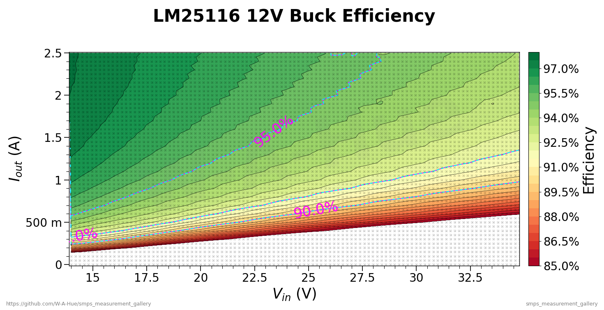

#### LM25116 Stock Power Loss
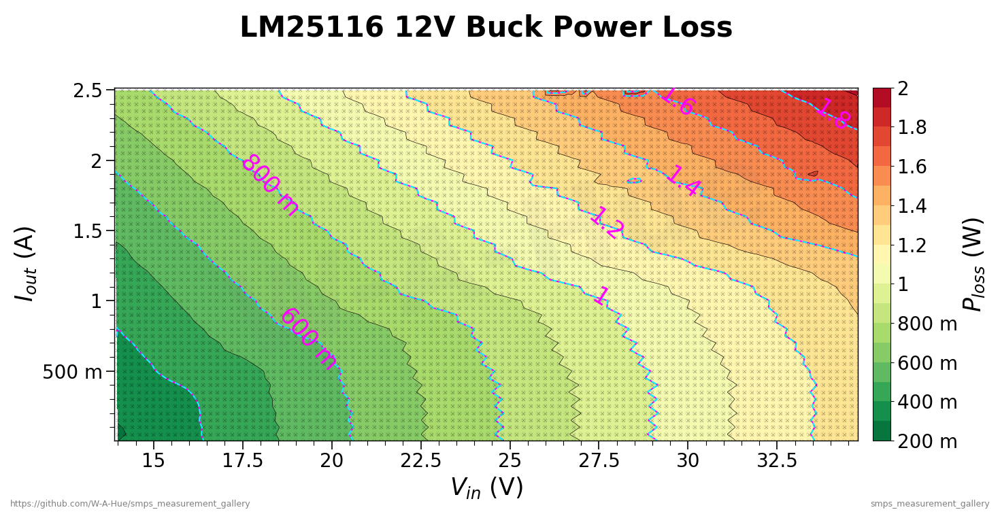

#### Stock Switching Frequency
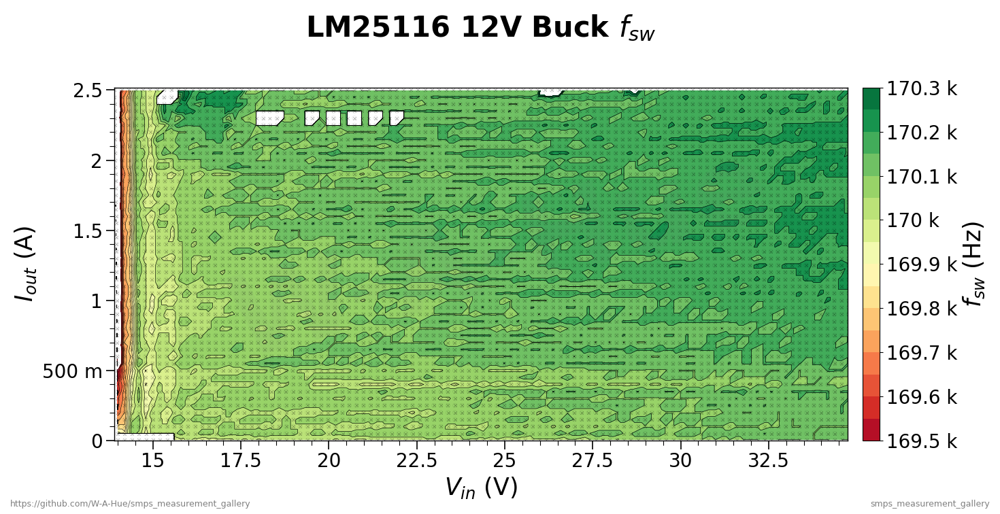

#### LM25116 Stock Output Voltage Ripple (peak-to-peak)
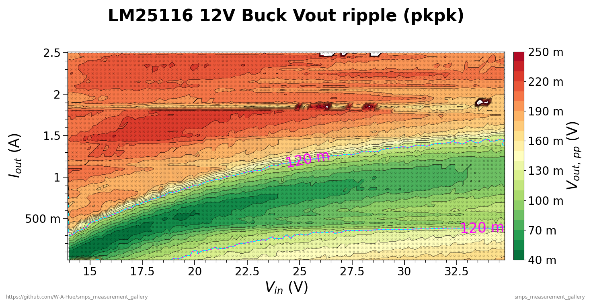

The [stock efficiency plot](#stock-efficiency) exhibits the typical contour pattern commonly observed for buck converters. As indicated by the marker lines, the converter enters the >90% efficiency region already at moderate load current.

At the same time, the [stock output voltage ripple plot](#stock-output-voltage-ripple-peak-to-peak) shows that the ripple performance is still problematic. At 12 V output, the 1% design specification corresponds to 120 mV peak-to-peak, and this limit is exceeded in parts of the operating range marked by the guide lines.

### LM25116 with Additional 3 uF Output Capacitance

In order to investigate whether this issue can be improved with a minimal hardware modification, three additional 1 uF MLCCs were added at the output. Apart from this added output capacitance, the module and test conditions remained unchanged.

#### LM25116 Efficiency with Additional 3 uF Output Capacitance
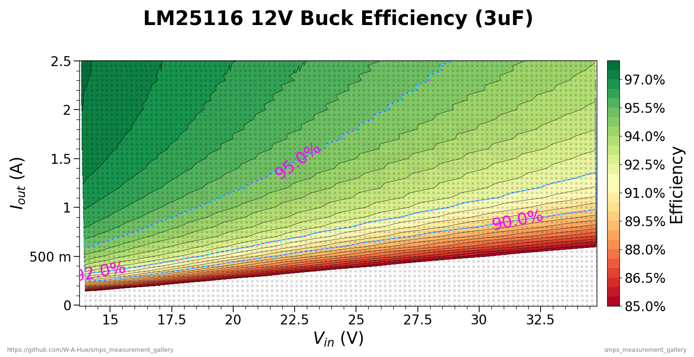

#### LM25116 Power Loss with Additional 3 uF Output Capacitance
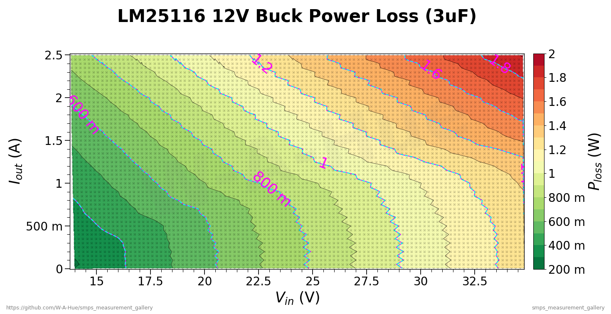

#### LM25116 Switching Frequency with Additional 3 uF Output Capacitance
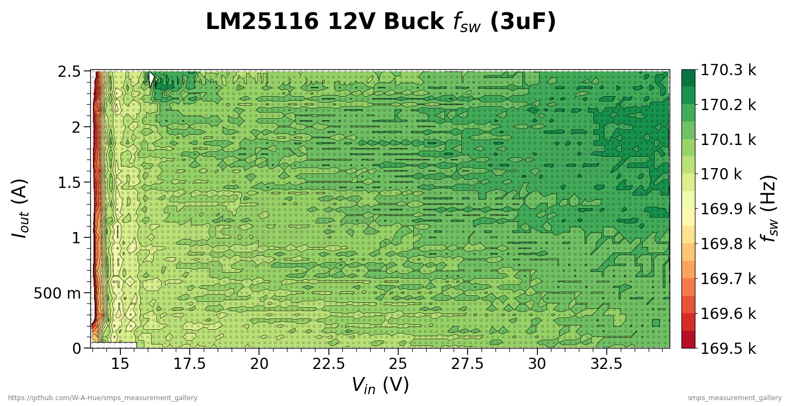

#### LM25116 Output Voltage Ripple (peak-to-peak) with Additional 3 uF Output Capacitance
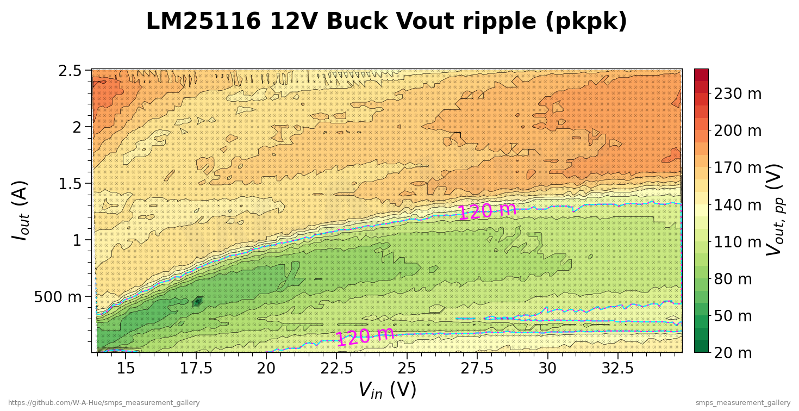

The additional 3 uF output capacitance reduces the magnitude of the output ripple, but does not fully resolve the issue. The ripple is improved compared to the stock configuration, yet it still remains above the 1% target in part of the operating range.

However, the absolute plots alone do not show whether this modification improves the output ripple uniformly across the full operating range, or how large the local changes actually are. To examine this in more detail, the stock and modified configurations are compared directly using differential plots.

### Differential Comparison: Stock Configuration vs. Additional 3 uF Output Capacitance

The following plots differ from the absolute plots shown above. Instead of showing the absolute value of each measured parameter, they show the differential change between the stock configuration and the modified variant with additional output capacitance, thus allowing to directly isolate the impact of a changed component.

In these differential plots, green indicates operating regions in which the parameter improved from the first variant to the second, white indicates little or no relevant change, and red indicates regions in which the plotted parameter became worse.

#### LM25116 Differential Efficiency
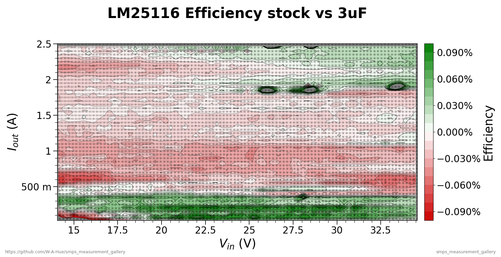

#### LM25116 Differential Power Loss
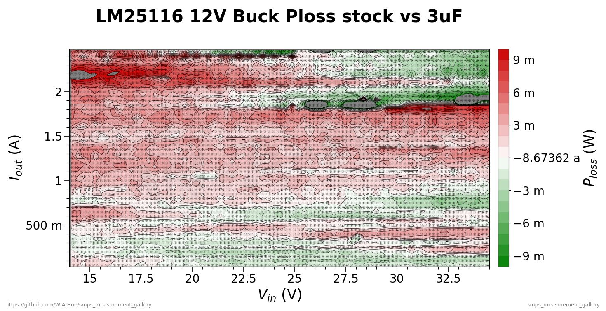

#### LM25116 Differential Switching Frequency
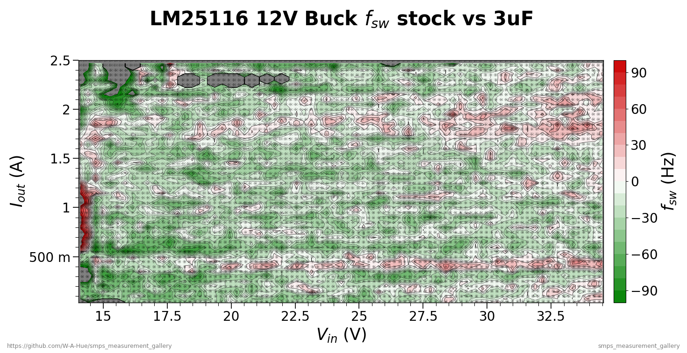

#### LM25116 Differential Output Voltage Ripple (peak-to-peak)
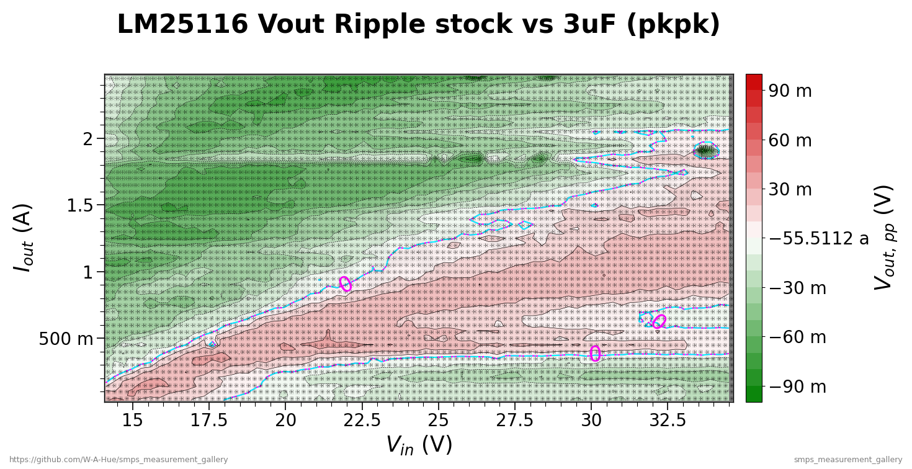

Overall, the differential plots show that the modification improves the output voltage ripple in some parts of the operating range, while in other regions the ripple becomes slightly worse. This suggests that the additional output capacitance did not simply reduce ripple uniformly, but also altered the overall system control behavior.

### AP3012-Based SEPIC Converter

The converter shown in this section is based on the AP3012, a regulator that is commonly used in low-power boost converter applications. In this case, however, it was implemented in a SEPIC topology.

This raises an interesting question. While the controller can in principle be used in such a configuration from a topological point of view, it is not immediately clear whether it can maintain stable operation in a fourth-order power stage such as a SEPIC converter over the full operating range.

#### AP3012 12V SEPIC Efficiency
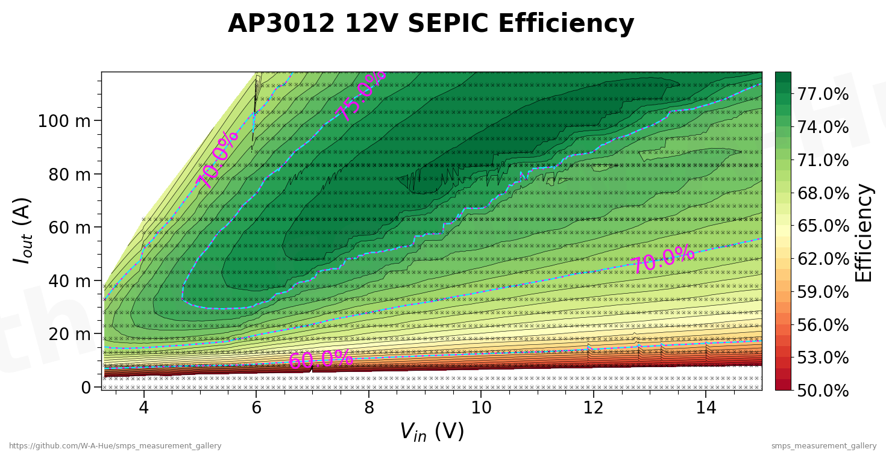

#### AP3012 12V SEPIC Output Voltage
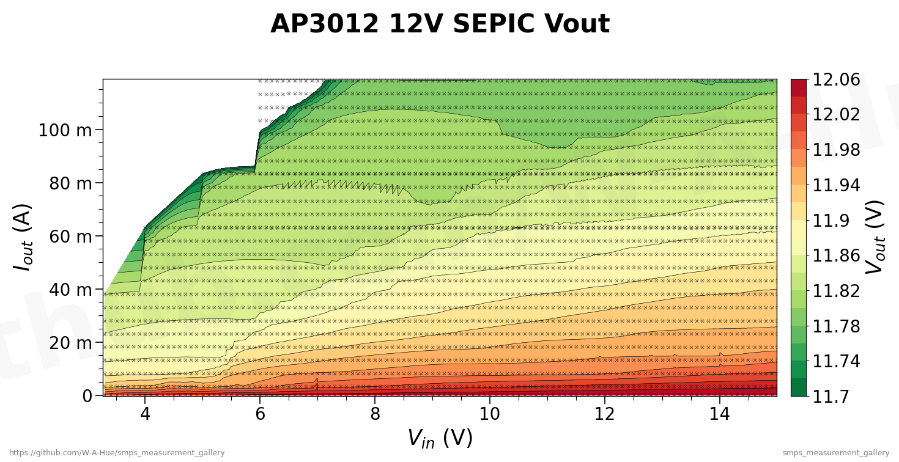

#### AP3012 12V SEPIC Output Voltage Ripple (peak-to-peak)
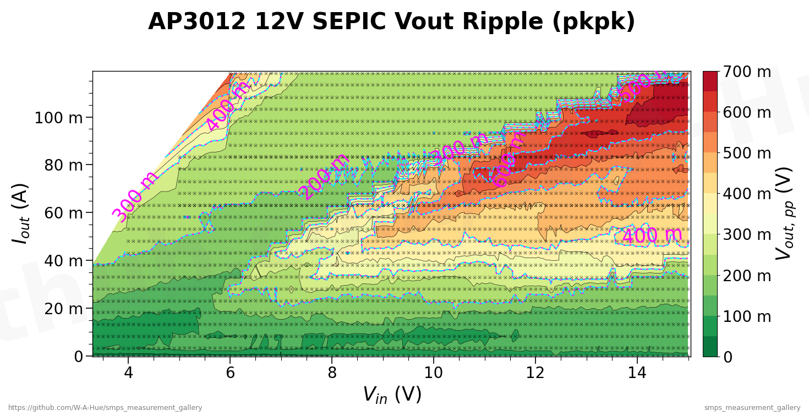

The measured efficiency and output voltage plots initially suggest that the converter is generally functional. However, the [output voltage ripple plot](#ap3012-12v-sepic-output-voltage-ripple-peak-to-peak) reveals a distinct operating region in which the ripple becomes excessively large compared to the surrounding area. This behavior is highly suspicious and points to a possible oscillation rather than a simple increase in switching ripple.

To investigate this in more detail, the output ripple was examined by visualizing the automatically sampled oscilloscope trace data in a waveform viewer.

#### AP3012 12V SEPIC Oscilloscope Capture of Output Ripple at an Unstable Operating Point
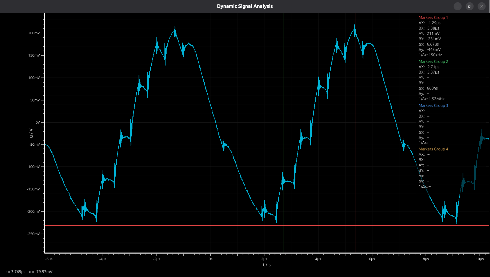

The oscilloscope trace confirms that the converter is not merely exhibiting increased switching ripple, but a clear low-frequency oscillation. As indicated by the red markers, the dominant oscillatory component is approximately 150 kHz, while the expected switching activity at about 1.5 MHz is still present and can be identified by the green markers riding on top of the low-frequency envelope.

## AC/DC Converters

### Generic 24 W USB-PD 12 V Charger

This section presents measurements of a generic 24 W USB-PD charger operated at a fixed 12 V output, negotiated via the USB-PD protocol using a USB-C trigger board. Since the adapter is specified for a wide AC input voltage range, it is particularly interesting to examine how its behavior changes with line voltage.

#### Generic 24 W Charger Efficiency Map
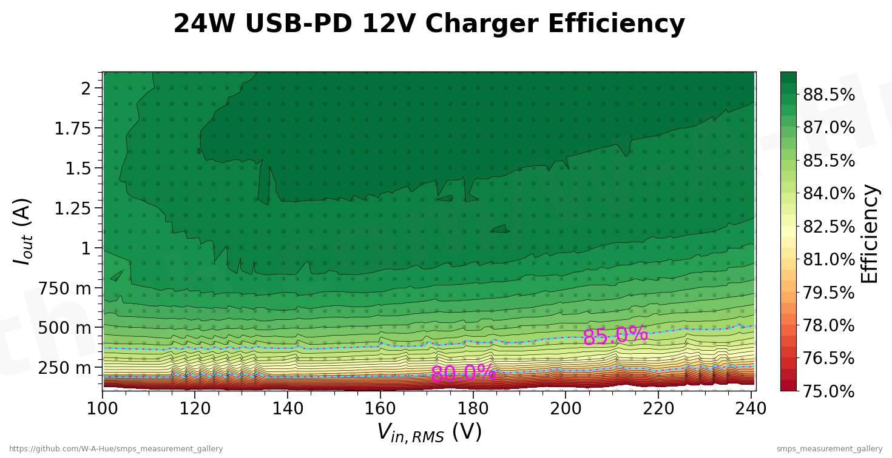

#### Generic 24 W Charger Power Factor Map
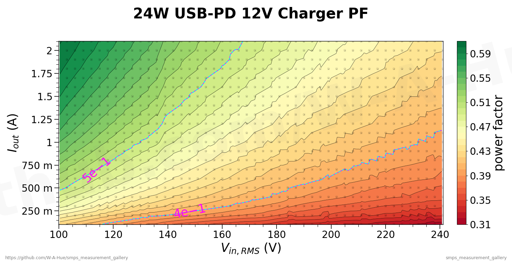

#### Generic 24 W Charger Efficiency Curves
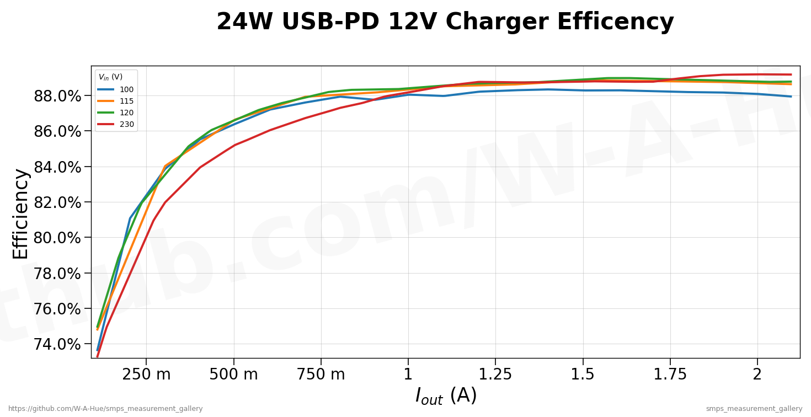

The efficiency map provides a compact overview of the charger behavior across the measured operating range. While the input voltage was swept in 3 V steps over the supported input range, practical mains voltages are typically encountered only at a limited number of nominal levels. For this reason, the efficiency data is also presented as a set of conventional curves.

The power factor plot reveals a clearly visible dependence on input voltage.
